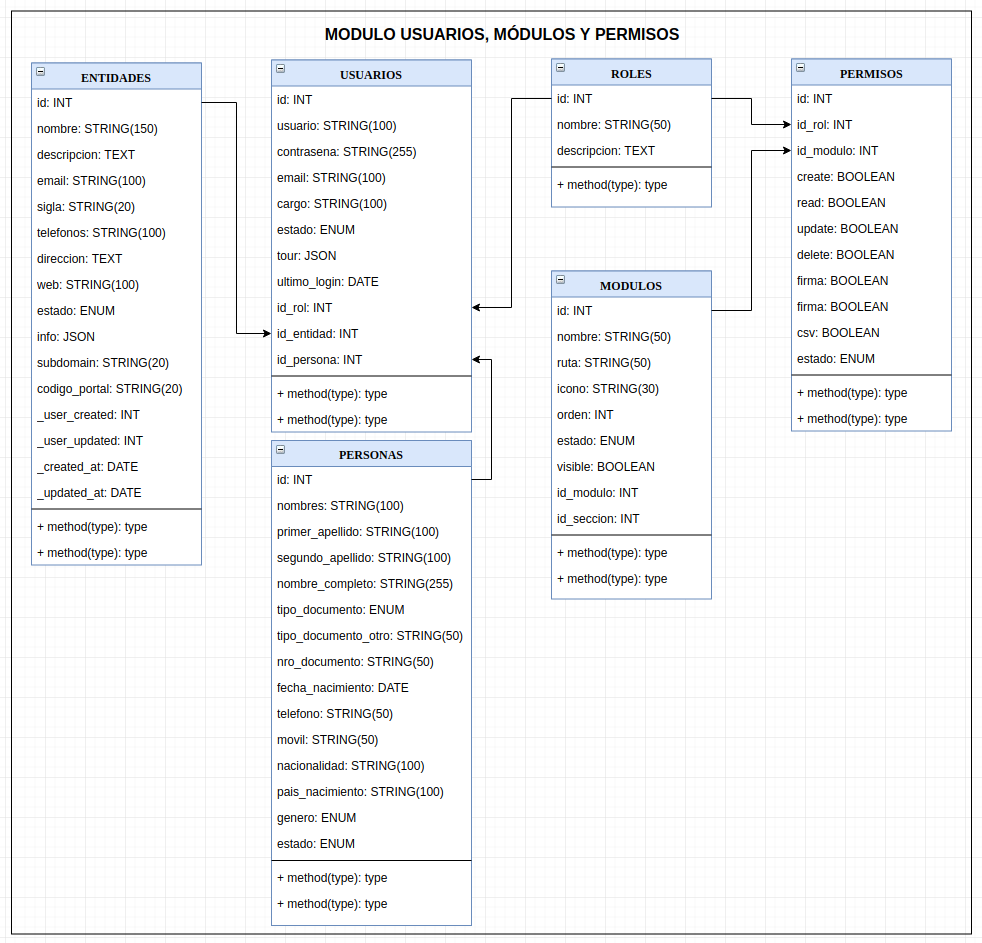

Arquitectura del Proyecto Base
=

El proyecto base se encuentra actualmente estructurada bajo la arquitectura  **Domain Driven Design (DDD)**, solo se tomó algunos conceptos básicos de esta arquitectura que se describen a continuación:


### La capa de infrastructura Transversal

La capa de infrastructura Transversal nos permite almacenar funcionalidades para las demás capas, en esta capa tenemos:

- **Common**, esta nos presenta servicios o librerías como ser: configuraciones del sistema, manejo de correo electrónico, internacionalización, etc.
- **NPM**, el gestor de paquetes de Nodejs también funciona como nuestro proveedor de librerías en esta capa.
- Módulo **app-iop**, este módulo nos ofrece servicios de interoperabilidad con las diferentes instituciones públicas.
- Módulo **app-notificaciones**, este módulo nos ofrece servicios que interactúan con el sistema de notificaciones del estado.
- Módulo **app-params** y **app-logs** son módulos para el manejo de parámetros y los logs del sistema almacenados en una base de datos.

### Infrastructure

Capa que provee las implementaciones del acceso a los datos del sistema, definición de los objetos del sistema y el acceso a los mismos. Para esta capa utilizamos el ORM Sequelize, para lo cual todas las funcionalidades de este ORM se manejan solo en esta capa, así mantenemos su independencia de otras capas, y si queremos cambiar de ORM no afectará a capas superiores, en esta capa encontramos:

- **Models**, son las definiciones de los objetos que maneja el sistema.
- **Repositories**, son los métodos que se encargan de devolver la información o modificar las datos en esta capa y que sirven como punto de acceso para las capas superiores, acá es donde manejamos todas las funcionalidades que nos ofrece el ORM elegido.

Se podría decir que esta capa maneja un comportamiento algo parecido a los Data Access Object (DAO) de otras arquitecturas.

### Domain

Capa donde se encuentran los conceptos del dominio y las reglas de negocio, es la capa más importante del sistema.

- **Services**, Esta sub capa es encargada de procesar las reglas de negocio, esta obtiene datos de la capa de infrastructura para luego procesarlo y devolver el resultado en un formato de respuesta común, para nuestro caso siempre devolvemos siempre la respuesta con el formato:

```
{
	"code": 1, // Donde: 1 es correcto, -1 es error y 0 es advertencia
	"data": "Datos de respuesta", // Se devuelve cadenas, números, objetos, etc.
	"message": "Mensaje personalizado"
}
```

- Estos services también podríamos usarlos para crear cronjobs del sistema.
- En esta capa podemos usar los servicios de interoperabilidad (app-iop) y notificaciones (app-notificaciones) necesarios para realizar la lógica de negocio.

Se podría decir que esta sub capa tiene una similitud y funcionalidad como lo son los Controllers de otras arquitecturas.

### Application

Capa que se encarga de gestionar la forma en que se presentará o accederá a la información que nos proporciona la capa de dominio o la capa de infrastructura utilizando tecnologías o estándares como api-rest o GraphQL entre otras.

En esta capa también es donde iniciamos nuestra instancia ExpressJS donde iniciamos un servidor web el cual devuelve o procesa la información de la capa de dominio, si bien se usa ExpressJs para crear esta instancia esta arquitectura hace que podamos usar cualquier otro framework parecido sin afectar las otras capas.

Esta capa se encarga de gestionar la seguridad y accesos a los diferentes módulos de nuestro sistema, también la gestión de seguridad y accesos podría estar en nuestra capa de dominio.

### Capa Web

Opcionalmente se puede usar esta capa para crear un servicio de **backend for frontend** donde podemos limitar el acceso a nuestra capa de aplicación mediante el uso de tokens internos, también podemos conectarnos a otros sistemas que no necesariamente estén hechos con NodeJS, es un proxy de comunicación entre nuestra capa de Aplicación y otros servicios externos, también se podría dar servicios a una diferente capa de presentación.

### Presentation

Capa responsable de  mostrar la información al usuario e interpretar los eventos de entrada del usuario. Esta capa se conecta con nuestra capa de Aplicación donde muestra ya los resultados finales devueltos por la capa de Aplicación.

Para nuestro caso usamos a Vue con el proyecto base frontend para nuestra capa de presentación.

Adicionalmente podríamos crear otra capa de presentación con cualquier otro framework que interactúe con la capa de Aplicación o con la capa Web.

### Estructura de la base de datos

Este base backend cuenta con un módulo de manejo de usuarios, roles, permisos y módulos entre otros, para lo cual se maneja la siguiente estructura de base de datos:



### Estructura del código fuente

La estrucutura detallada del código fuente se detalle en [Codigo.md](Codigo.md)
