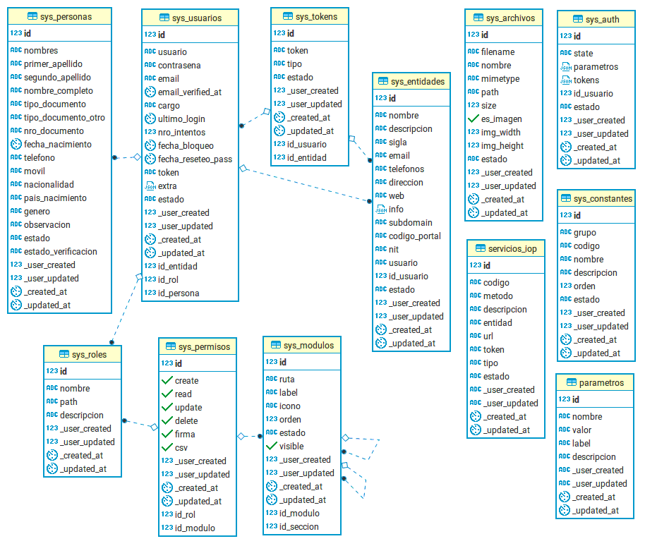
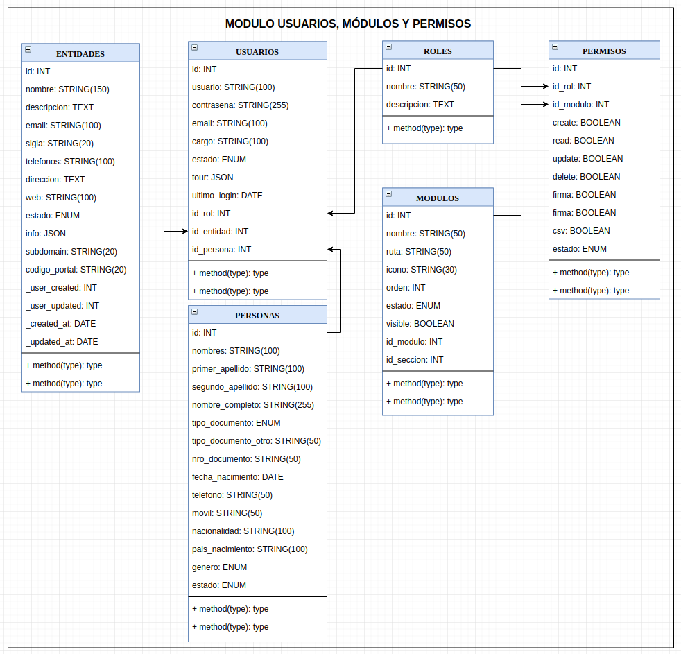

## Modelo de base de datos

## Roles y permisos

Las relaciones usuarios, entidades, roles, permisos, modulos permiten definir una jerarquía de permisos y roles de acuerdo a las necesidades particulares del sistema en el que se usa este proyecto base.

